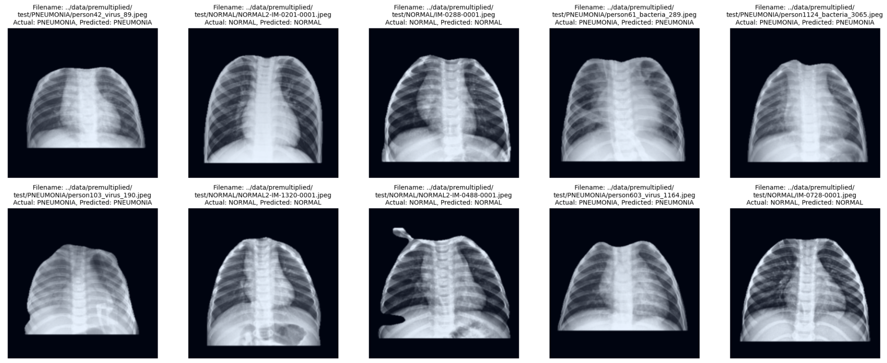
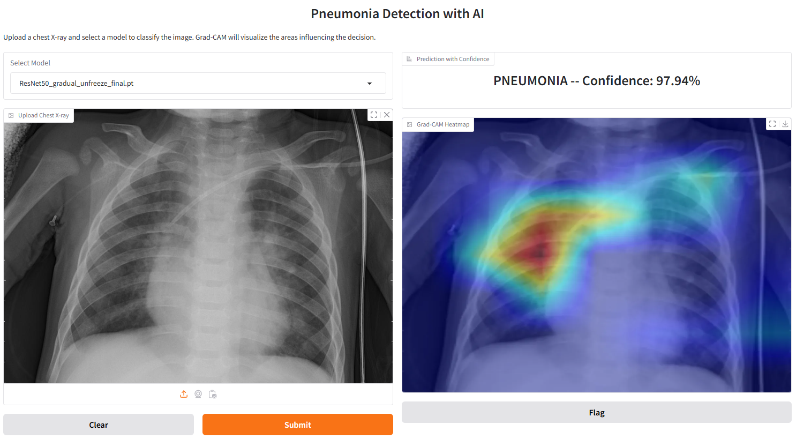

# Pneumonia Detection 
Medical image classification plays a vital role in healthcare, aiding in precise and timely disease diagnosis. This project focuses on developing a flexible machine learning-based classification system to evaluate and compare the performance of various models on the Chest X-ray Images (Pneumonia) dataset from Kaggle. The dataset consists of 5,863 labeled chest X-ray images divided into two categories: Normal and  Pneumonia.

The primary objective is to identify the best-performing model for pneumonia detection by leveraging transfer learning with pre-trained convolutional neural networks such as DenseNet131, EfficientNet, ResNet18, ResNet50, and exploring transformer-based methods like Visual Transformers (ViT). The project emphasizes fine-tuning these models to ensure optimal performance on the dataset.

To comprehensively evaluate model performance, metrics including Accuracy, F1-Score, Precision, Recall, Specificity, AUC/ROC curves, and confusion matrices are employed. Additionally, Grad-CAM is utilized for visualization and explainability, highlighting the critical lung regions influencing the models' predictions.

The ultimate goal is to build a robust and adaptable classifier written with Pytorch Lightning, capable of reliably distinguishing between healthy lungs and pneumonia-affected lungs. This project underscores the potential of deep learning models in advancing medical image analysis and supporting radiologists in early disease diagnosis through systematic model comparison and explainability.



### Technical Documentation
The full technical Documentation can be found at:
```
https://szabadosa.github.io/pneumonia_detection/
```
### Gradio Interface for User-Friendly Inference
A **Gradio** web interface has been built to provide a simple and interactive way to use the pneumonia detection model. Users can upload their chest X-ray images and receive predictions with confidence scores. The interface also includes **Grad-CAM visualizations**, offering insights into the areas of the image that influenced the model’s decision. This tool makes AI-driven pneumonia detection more accessible for researchers and healthcare professionals.



# Dataset
The project is based on the public chest-xray-pneumonia kaggle dataset:
```
https://www.kaggle.com/datasets/paultimothymooney/chest-xray-pneumonia
```
All images, pretrained models and misc can be downloaded at:
```
https://drive.google.com/drive/folders/1MIcgEqpcMU24N4lEFqmBIhDUXR6jAzv2?usp=sharing
```

All downloaded folders should be placed in the root of the project directory.
```
project/
├── checkpoints/                 
├── code/ 
├── data/ 
├── models/
├── notebooks/  
```


# Pneumonia Detection

This project provides a machine learning-based pneumonia detection system. Follow the steps below to set up and run the project.

---

## Installation Guide

### **1. Prerequisites**
Ensure you have the following installed:
- [Miniconda](https://docs.conda.io/en/latest/miniconda.html) (or Anaconda)
- Python **3.12.3** (installed via Conda)
- A GPU with CUDA support (Optional but recommended for deep learning)

---

### **2. Clone the Repository**
Open a terminal or command prompt and run:

```
git clone https://github.com/SzabadosA/pneumonia_detection.git
cd pneumonia-detection
```

---

### **3. Set Up the Conda Environment**
Create and activate a new Conda environment, replace <custom_name> with a name of your choice (e.g. pneumonia_detection):

```
conda create --name <custom_name> python=3.12.3
conda activate <custom_name>
```

---

### **4. Install Dependencies**
#### **Install via Install script**
All necessary dependencies can be installed by running the install script 
within the activated Conda environment:
```
python install.py
```

#### **Alternative: Manually install dependencies**
Instead of the install script, the dependencies also can be installed manually using the following commands:

```
conda install pytorch torchvision torchaudio pytorch-cuda=11.8 -c pytorch -c nvidia
conda install conda-forge::pytorch-lightning
conda install conda-forge::torchmetrics
conda install conda-forge::tensorboard
conda install conda-forge::grad-cam
conda install conda-forge::albumentations
conda install conda-forge::opencv
conda install conda-forge::matplotlib
conda install conda-forge::torchcam
conda install conda-forge::segmentation-models-pytorch
conda install conda-forge::transformers
pip install gradio

```


---

### **5. Running the Interface**
To run the interface, simply execute:

```
python interface.py
```


---

## Project Structure
```
pneumonia-detection/
│── Research_Report.pdf    # Project Research Report
│── interface.py           # Main entry point for running the interface
│── install.py             # Install Script for dependencies
│── README.md              # This file
│── checkpoints/           # (To be downloaded) Training checkpoints
│── code/                  # Source code
│── data/                  # (To be downloaded) Dataset folder
│── misc/                  # Readme Image Files
│── models/                # (To be downloaded) Saved models
│── notebooks/             # Jupyter notebooks for exploration
```

---

## **Next Steps**
- Run Interface for Pneumonia Classification and start exploring the pretrained models: `python interface.py`
- Explore Notebooks: The source code for all provided models can be found in their dedicated notebooks in `./notebooks/`
- Explore the Research Report
---

## **💌 Contact**
For questions or issues, open an [issue on GitHub](https://github.com/SzabadosA/pneumonia_detection.git).

---

## **📚 License**
This project is licensed under the MIT License.


